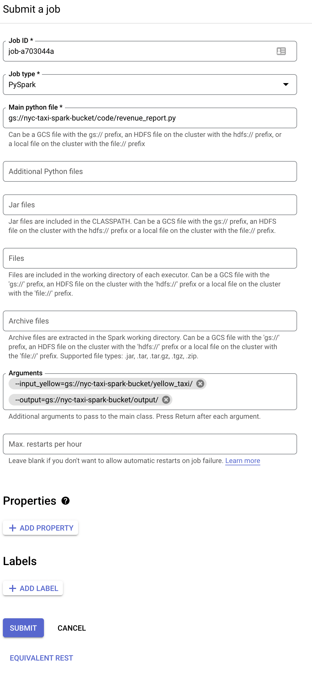

# Dataproc Setup

Dataproc is a fully managed and highly scalable service for running Apache Hadoop, Apache Spark, Apache Flink, Presto, and 30+ open source tools and frameworks. Use Dataproc for data lake modernization, ETL, and secure data science, at scale, integrated with Google Cloud, at a fraction of the cost.


## Create a Dataproc Cluster

1. Go to the [Dataproc](https://console.cloud.google.com/dataproc/clusters) page in the GCP Console. (Enable the Dataproc API if prompted.)
2. Click **Create Cluster**.
3. We will create a Cluster on a Compute Engine and NOT Kubernetes.
4. Give the Cluster a name
5. Region: europe-west3
6. Zone: europe-west3-c
7. We will go with a single node cluster (1 master, 0 workers), in pratice if you have a lot of data you will need more workers.
8 Click on **Create**

## Submit a Spark Job

For submitting a spark job we first need to create a python file (you can find the `revenue_report.py` file in the src folder) and upload it to a GCS bucket. We will use the same bucket as before. But it is also common to have a seperate bucket for the code. The python file will  basically do the same as we did yesterday with spark: Load the data, create a Revenue Report and save it back to a bucket.

```python
parser = argparse.ArgumentParser()

parser.add_argument('--input_yellow', required=True)
parser.add_argument('--output', required=True)

args = parser.parse_args()

input_yellow = args.input_yellow
output = args.output


spark = SparkSession.builder \
    .appName('test') \
    .getOrCreate()
``` 

We will use argparse to parse the arguments from the command line. Baiscally we will pass the input and output path to the script. What is the main difference to yesterdays script is that we have to leave out the `.master("local[*]") \` line in the SparkSession. This is because we are running the script on a cluster and not locally. 

Now let is upload the script to the bucket. 

```bash
gsutil cp src/revenue_report.py gs://<bucket-name>/code/
```

Now we can submit the job to the cluster. Back in the Dataproc Cluster page click on **Submit Job**.

1. Give the job a name
2. Job Type: PySpark
3. Main Python file: `gs://<bucket-name>/code/revenue_report.py`
4. Arguments:
 - `--input_yellow=gs://<bucket-name>/yellow_taxi/` press return/enter
 - `--output=gs://<bucket-name>/output/` press return/enter



5. Click on **Submit**

The job is submitted and you can see the progress in the console.

After the job is finished you can check the output in the bucket.

We started the job now in the ui but there are of course other ways to submit a job. You can use the gcloud command line tool or the REST API.

The equivalent command for submitting the job would be:

```bash
gcloud dataproc jobs submit pyspark \
    --cluster=de-zoomcamp-cluster \
    --region=europe-west3 \
    gs://<bucket-name>/code/revenue_report.py \
    -- \
        --input_yellow=gs://<bucket-name>/yellow_taxi/ \
        --output=gs://<bucket-name>/output/

```

or the REST API:

```json
POST /v1/projects/positive-sector-383614/regions/europe-west3/jobs:submit/
{
  "projectId": "positive-sector-383614",
  "job": {
    "placement": {},
    "statusHistory": [],
    "reference": {
      "jobId": "job-fa0bc8b0",
      "projectId": "positive-sector-383614"
    },
    "pysparkJob": {
      "mainPythonFileUri": "gs://<bucket-name>/code/revenue_report.py",
      "properties": {},
      "args": [
        "--input_yellow=gs://<bucket-name>/yellow_taxi/",
        "--output=gs://<bucket-name>/output/"
      ]
    }
  }
}
```